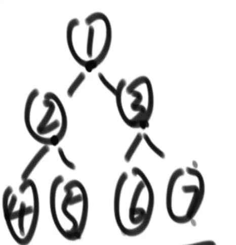

## 题目一

> 用递归和非递归两种方式实现二叉树的先序、中序、后序遍历
>
> 如何直观的打印一颗二叉树 （不考）
>
> 如何完成二叉树的宽度优先遍历(常见题目：求一棵二叉树的宽度)

1. 什么是递归序？

> 每个节点都会被访问三次。

```java
	public void f(TreeNode root) {
        // 1
        if(root == null) {
            return;
        }
        // 1
        f(root.left());
        // 2
        // 2
        f(root.right());
        // 3
        // 3
    }
```



递归序为：124442555213666377731

2. 先序遍历（头左右，递归序第一次出现时打印），也是二叉树的深度优先遍历

> 1245367

```java
	public void preOrderRecursion(TreeNode root) {
        if(root == null) {
            return;
        }
        System.out.println(root.value());
        f(root.left());
        f(root.right());
    }
 
	// 自己压栈，头出栈，打印，右左入栈，依次循环
	public void preOrderUnRecursion(TreeNode root) {
        if(root == null) return;
        Stack<TreeNode> stack = new Stack<>();
        stack.push(root);
        while(!stack.isEmpty()) {
            root = stack.pop();
            System.out.print(root.value());
            if(root.right() != null) {
                stack.push(root.right());
            }
            if(root.left() != null) {
                stack.push(root.left());
            }
        }
    }
```


3. 中序遍历（左头右，递归序第二次出现时打印）

> 4251637

```java
	public void inOrderRecursion(TreeNode root) {
        if(root == null) {
            return;
        }
        f(root.left());
        System.out.println(root.value());
        f(root.right());
    }

	// 自己压栈、二叉树左边界入栈，指向null时，弹出栈，并打印，指向右子树，循环往复
	public void inOrderUnRecursion(TreeNode root) {
        if(root == null) {
            return;
        }
        Stack<TreeNode> stack = new Stack<>();
        while(root != null || !stack.isEmpty()) {
            if(root != null) {
                stack.push(root);
                root = root.left();
            } else {
                root = stack.pop();
                System.out.print(root.value());
                root = root.right();
            }
        }
    }
```


4. 后序遍历（左右头，递归序第三次出现时打印）

> 4526731

```java
	public void afterOrderRecursion(TreeNode root) {
        if(root == null) {
            return;
        }
        f(root.left());
        f(root.right());
        System.out.println(root.value());
    }

	// 两个栈，头出栈1入栈2，右左入栈1，至栈1空，依次弹出栈2并打印
	public void afterOrderUnRecursion(TreeNode root) {
        if(root == null) {
            return;
        }
        Stack<TreeNode> inStack = new Stack<>();
        Stack<TreeNode> outStack = new Stack<>();
        inStack.push(root);
        while(!inStack.isEmpty()) {
            root = inStack.pop();
            outStack.push(root);
            if(root.right() != null) {
                inStack.push(root.right());
            }
            if(root.left() != null){
                inStack.push(root.left());
            }
        }

        while(!outStack.isEmpty()) {
            System.out.println(outStack.pop().value());
        }
    }
```

5. 二叉树的宽度优先遍历怎么搞？

> 使用队列，头出队列并打印，左右入队列，依次遍历

```java
	public void widthSearch(TreeNode root) {
        if(root == null) return;
        Queue<TreeNode> queue = new LinkedList<>();
        queue.add(root);
        while(!queue.isEmpty()) {
            root = queue.remove();
            System.out.println(root.value());
            if(root.left() != null) {
                queue.add(root.left());
            }
            if(root.right() != null) {
                queue.add(root.right());
            }
        }
    }
```

6. 求二叉树的最大宽度

```java
	public void maxWidthWithMap(TreeNode root) {
        if(root == null) return;
        Queue<TreeNode> queue = new LinkedList<>();
        queue.add(root);
        Map<TreeNode, Integer> levelMap = new TreeMap<>();
        levelMap.put(root, 1);
        int curLevel = 1;
        int curNodes = 0;
        int max = Integer.MIN_VALUE;
        while(!queue.isEmpty()) {
            root = queue.remove();
            if(curLevel == levelMap.get(root)) {
                curNodes++;
            } else {
                max = Math.max(max, curNodes);
                curNodes = 1;
                curLevel++;
            }

            if(root.left() != null) {
                queue.add(root.left());
                levelMap.put(root.left(), curLevel + 1);
            }
            if(root.right() != null) {
                queue.add(root.right());
                levelMap.put(root.right(), curLevel + 1);
            }
        }
    }

    public void maxWidthNoMap(TreeNode root) {
        if(root == null) return;
        Queue<TreeNode> queue = new LinkedList<>();
        queue.add(root);
        TreeNode curEnd = root;
        TreeNode nextEnd = null;
        int curNodes = 0;
        int max = Integer.MIN_VALUE;
        while(!queue.isEmpty()) {
            root = queue.remove();
            if(root == curEnd) {
                // 结算当前行
                max = Math.max(max, curNodes);
                curNodes = 0;
                curEnd = nextEnd;
                nextEnd = null;
            } else {
                curNodes++;
            }

            if(root.left() != null) {
                queue.add(root.left());
                nextEnd = root.left();
            }
            if(root.right() != null) {
                queue.add(root.right());
                nextEnd = root.right();
            }
        }
    }
```


## 总结

1. 任何递归都可以转为非递归（递归的本质是利用系统栈，可以改为自定义栈进行操作）